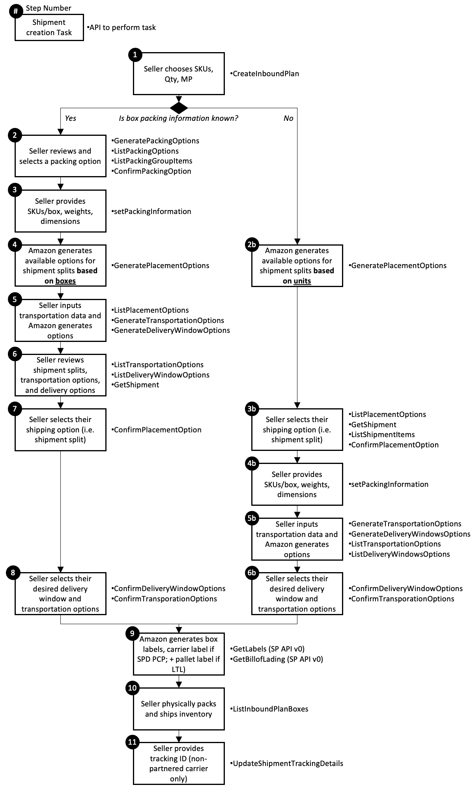

# 亚马逊FBA（由亚马逊配送）的入库货件创建过程


这张流程图展示了亚马逊FBA（由亚马逊配送）的入库货件创建过程，逐步说明了每个任务、决策点及相关API调用。

## 流程步骤解释

1. **卖家选择SKU、数量和销售市场**
    - **API调用:** `CreateInboundPlan`
    - **说明:** 卖家选择要发往亚马逊的SKU（库存单位）、指定数量，并选择销售市场（如美国、英国等），这一步开始创建入库计划。
2. **是否已知箱子包装信息？**
    - 该决策点判断卖家是否已经拥有详细的箱子包装信息（如重量、尺寸和每箱数量）。
    - **如果已知：**
        - **步骤 2** – **卖家审查并选择包装选项**
            - **API调用:** `GeneratePackingOptions`, `ListPackingOptions`, `ListPackingGroupItems`, `ConfirmPackingOption`
            - **说明:** 卖家查看不同的包装选项，并选择适合的选项。亚马逊会基于SKU和数量提供多种包装建议。
    - **如果未知：**
        - **步骤 2b** – **亚马逊根据单位生成可用的货件拆分选项**
            - **API调用:** `GeneratePlacementOptions`
            - **说明:** 由于没有箱子层级的详细信息，亚马逊根据单位建议拆分货件的方式。
3. **卖家提供SKU/箱数、重量和尺寸信息**
    - **API调用:** `setPackingInformation`
    - **说明:** 卖家输入具体的包装信息，如每个箱子中的SKU数量、箱子重量和尺寸，以便亚马逊能够进一步生成货件建议。
4. **亚马逊基于箱子信息生成可用的货件拆分选项**
    - **API调用:** `GeneratePlacementOptions`
    - **说明:** 亚马逊使用卖家提供的箱子信息，为货件生成合适的拆分选项。
5. **卖家输入运输数据，亚马逊生成运输和送货选项**
    - **API调用:** `ListPlacementOptions`, `GenerateTransportationOptions`, `GenerateDeliveryWindowOptions`
    - **说明:** 卖家输入运输相关数据，亚马逊提供可用的运输和送货选项，方便卖家选择。
6. **卖家查看货件拆分、运输和送货选项**
    - **API调用:** `ListTransportationOptions`, `ListDeliveryWindowOptions`, `GetShipment`
    - **说明:** 卖家查看亚马逊提供的运输和送货选项，并确认是否符合需求。
7. **卖家选择运输选项（即货件拆分）**
    - **API调用:** `ConfirmPlacementOption`
    - **说明:** 卖家选择适合的运输和货件拆分选项，以便亚马逊继续处理货件。
8. **卖家选择理想的送货窗口和运输选项**
    - **API调用:** `ConfirmDeliveryWindowOptions`, `ConfirmTransportationOptions`
    - **说明:** 卖家确认最终的送货窗口和运输方式。
9. **亚马逊生成箱子标签、承运商标签（若SPD则生成每箱标签，若LTL则生成托盘标签）**
    - **API调用:** `GetLabels`（SP API v0）, `GetBillOfLading`（SP API v0）
    - **说明:** 亚马逊为货件生成运输标签，SPD（小包裹配送）生成每箱标签，LTL（少于卡车载货）生成托盘标签。
10. **卖家实际打包并发货**
- **API调用:** `ListInboundPlanBoxes`
- **说明:** 卖家根据亚马逊提供的标签进行实际打包，并发货至亚马逊指定的仓库。
1. **卖家提供追踪ID（非合作承运商）**
- **API调用:** `UpdateShipmentTrackingDetails`
- **说明:** 卖家使用非合作承运商时，需要在系统中更新追踪ID，以便亚马逊能跟踪货件。


## API调用顺序
### Step 1. 创建入库计划


入库计划用于表示卖家打算入库到亚马逊配送网络的一批商品。通过调用 `createInboundPlan` 操作，卖家必须提供以下信息：

- **发货地址**：货物的发货地地址。
- **市场**：商品将要发往的亚马逊市场。
- **商品摘要**：包括卖家打算入库的商品信息。

商品摘要中需包含：

- **MSKU**：商品的唯一识别码。
- **数量**：入库的数量。
- **准备/标签责任方**：决定谁负责商品的准备和标签。注意，只有在注册了 FBA 标签服务的情况下，才能选择 **AMAZON** 作为标签持有人。


创建成功的响应将返回一个唯一的 `inboundPlanId`，用于标识入库计划（相当于 “工作流 ID”）。
::: danger
在创建入库计划的工作流中，`inboundPlanId` 是一个关键参数。它是所有后续操作中必需的唯一标识符，只能通过调用 `createInboundPlan` 接口获取。成功生成 `inboundPlanId` 后，它将在整个入库工作流中作为必传参数，确保各个步骤能够正确关联到该计划。

确保在第一次创建入库计划后妥善保存 inboundPlanId，以避免重新调用接口来获取该值。
:::
<div class="divider">Amazon相关要求</div>

::: tip

- 请确保发货的每件商品都符合亚马逊的产品包装要求。详情请查看卖家平台帮助中心的 “包装和准备要求”。
- 卖家可以在 "发送至亚马逊" 页面上为每个 SKU 设置准备类别，可以一次性设置一个或最多 25 个 SKU。此设置仅需进行一次，并将应用到所有后续的入库计划。
- 单个 SKU 在一个入库计划中不支持多个到期日期。如需将具有多个到期日期的 SKU 发送到配送网络，需要创建多个入库计划。
- 卖家可以为每件商品选择性地添加到期日期和生产批次代码。

:::

::: code-group
``` json[Request example]
POST /inbound/fba/2024-03-20/inboundPlans
{
  "destinationMarketplaces" : [ "ATVPDKIKX0DER" ],
  "items" : [ {
    "expiration" : "2024-01-01",
    "labelOwner" : "AMAZON",
    "manufacturingLotCode" : "manufacturingLotCode",
    "msku" : "Sunglasses",
    "prepOwner" : "AMAZON",
    "quantity" : 10
  } ],
  "name" : "My inbound plan",
  "sourceAddress" : {
    "addressLine1" : "123 example street",
    "addressLine2" : "Floor 19",
    "city" : "Toronto",
    "companyName" : "Acme",
    "countryCode" : "CA",
    "email" : "email@email.com",
    "name" : "name",
    "phoneNumber" : "1234567890",
    "postalCode" : "M1M1M1",
    "stateOrProvinceCode" : "ON"
  }
}
```
```json [Response example]
{
  "operationId": "operationId1234",
  "inboundPlanId": "PlanID1234"
}

```


:::


### Step2: 确定那些SKU可以一起打包

这一步骤是为了帮助亚马逊卖家确定哪些SKU（库存单位）可以一起打包。因为不同SKU可能有不同的处理要求或履行中心的限制，卖家需要识别哪些SKU可以放在同一个包裹中，哪些则必须分开打包。

为了完成以上要求所需要依次调用以下接口：
- `generatePackingOptions`
- `listPackingOptions`
- `listPackingGroupItems`
- `confirmPackingOption`


#### Step 2a.生成包装选项（获取唯一操作标识）


首先，先调用`generatePackingOptions`生成包装选项，卖家必须提供以下信息：
- 入库计划Id：入库计划的唯一标识


调用成功之后，该接口会返回一个操作Id，和冗余返回入库计划的唯一标识
- 操作Id： 标识当前操作的 UUID

::: code-group

```json [Request example]
POST /inbound/fba/2024-03-20/inboundPlans/{inboundPlanId}/packingOptions
```
```json [Response example]
{
  "operationId": "string",
  "inboundPlanId": "string"
}
```
:::

#### Step 2b. 列出包装选项
> 读者认为： 每一个包装选项就是一个针对该入库计划所有商品的包装策略，内包含不同的包装组id， 卖家只能为其计划分配一个包装选项


在生成包装选项之后，调用`listPackingOptions`,列出Amazon为客户准备的相关包装选项，卖家必须提供以下信息：
- 入库计划id： 入库计划的唯一标识
- [可选]页大小：（1，20）
- [可选]页token：每一页的token


调用成功之后，会返回以下内容：
- 包装选项列表：指定每个选项的包装组<id列表>、费用/折扣和支持的运输方式。
- 下一页的token

:::code-group
```json[Request example]
GET /inbound/fba/2024-03-20/inboundPlans/{inboundPlanId}/packingOptions
```
```json[Response example]
{
  "pagination": {
    "nextToken": "string"
  },
  "packingOptions": [
    {
      "inboundPlanId": "string",
      "packingOptionId": "string",
      "packingGroups": [
        "string"
      ],
      "fees": [
        {
          "currency": {
            "code": "string",
            "amount": 0
          },
          "type": "FEE",
          "target": "OUTBOUND_PER_SHIPMENT",
          "description": "string"
        }
      ],
      "discounts": [
        {
          "currency": {
            "code": "string",
            "amount": 0
          },
          "type": "FEE",
          "target": "OUTBOUND_PER_SHIPMENT",
          "description": "string"
        }
      ],
      "expiration": "2019-08-24T14:15:22Z",
      "status": "OFFERED",
      "supportedShippingModes": [
        {
          "shippingSolution": "AMAZON_PARTNERED_CARRIER",
          "shippingMode": "GROUND_SMALL_PARCEL"
        }
      ]
    }
  ]
}
```
:::
<div class="divider">Amazon相关要求</div>

:::tip
- 每一次调用返回都会携带下一页的token。获取第一页响应，可以不携带页token（默认第一页）

:::
<div class="divider">其他Amazon信息</div>

::: tip
包装选项包含多个打包组（Packing Groups），卖家可以根据这些组进行选择。每个选项还附带了一些额外信息，以帮助卖家在不同选项间做出选择。附加信息包括：

- 每个选项的费用/折扣
- 支持的运输模式
- 选项的到期日期
:::

#### Step 2c. 列出每个包装选项中的物品
> 读者认为： 这个接口就是个预览接口， 卖家可以利用这个接口预览选择某个包装Id后的各个包装组的详细信息。

要预览每个包装组的物品，请使用`listPackingGroupItems`操作， 卖家必须提供以下信息：
- 入库计划id： 入库计划的唯一标识
- 包装选项id： 包装选项的唯一标识 
- 包装组id：  包装组的唯一标识
- 页大小：（1-20）
- 页token：每一页都会有一个唯一的token

调用成功之后，会返回以下内容：
- 提供入库计划中的基本商品信息列表，包括数量和准备责任方的识别。
- 下一页的token

::: code-group
```json[Request example]
GET /inbound/fba/2024-03-20/inboundPlans/{inboundPlanId}/packingGroups/{packingGroupId}/items

params = {
    "pageSize": 20,
    "paginationToken":''
}
```
```json[Response example]
{
  "pagination": {
    "nextToken": "string"
  },
  "items": [
    {
      "msku": "string",
      "asin": "string",
      "fnsku": "string",
      "labelOwner": "AMAZON",
      "quantity": 1,
      "prepOwner": "AMAZON"
    }
  ]
}
```
:::

#### Step 2d. 选择包装选项（确认包装）
> 读者认为： 这一步骤就是卖家确定为起入库计划选择`listPackingOptions`接口所提供的包装选择id， 不可逆。

要选择包装选项，请使用`confirmPackingOption`接口，卖家必须提供以下信息：
- 入库计划id： 入库计划的唯一标识
- 包装选项id： 包装选项的唯一标识

调用成功之后，会返回以下内容：
- 操作Id： 标识当前操作的 UUID

::: code-group
```json[Request example]
POST /inbound/fba/2024-03-20/inboundPlans/{inboundPlanId}/packingOptions/{packingOptionId}/confirmation
```
```json[Response example]
{
  "operationId": "string"
}
```
:::


### Step 3. 提供包装箱内容信息

为了提供有关每个箱子所包装物品的信息，请使用`setPackingInformation`操作。通过调用 setPackingInformation，卖家必须为每个打算入库的箱子传递以下信息：
  - 包装组 ID
  - 箱子内容信息来源
  - 箱子内容（物品、物品数量、每种物品的准备/标签负责人）
  - 箱子信息（尺寸、重量和箱子数量）

调用成功之后，会返回以下内容：
  - 操作单元id

::: code-group
```json [Request example]
POST /inbound/fba/2024-03-20/inboundPlans/{inboundPlanId}/packingInformation
{
  "packageGroupings": [
    {
      "packingGroupId": "string",
      "boxes": [
        {
          "weight": {
            "unit": "LB",
            "value": 0
          },
          "dimensions": {
            "unitOfMeasurement": "IN",
            "length": 0,
            "width": 0,
            "height": 0
          },
          "quantity": 1,
          "items": [
            {
              "msku": "string",
              "quantity": 1,
              "expiration": "string",
              "prepOwner": "AMAZON",
              "labelOwner": "AMAZON",
              "manufacturingLotCode": "string"
            }
          ],
          "contentInformationSource": "BOX_CONTENT_PROVIDED"
        }
      ]
    }
  ]
}
```
```json [Response example]
{
  "operationId": "string"
}
```
:::
::: danger
> 读者发现：在该请求的请求示例中 boxes列表中不应该出现boxId字段信息, 理由是`boxes`是文档中所提供的`BoxInput`类对象实例列表, 而`BoxInput`在原文中并不存在`boxId`的属性， 并且上下文中也没有说明该参数的数据来源。
:::
<div class="divider">Amazon相关要求</div>

::: tip
如果卖家使用 `setPackingInformation` 提供了箱子包装信息、生成了分配选项后，又编辑了箱子包装信息，则需要在调用 `confirmPlacementOption` 之前再次调用 `generatePlacementOptions`。如果卖家输入了箱子包装信息但之后决定完全放弃这些信息，则需要使用 `createInboundPlan` 开始一个新的入库计划。目前不支持直接放弃包装信息。
> 也就是`setPackingInformation` -> `generatePlacementOptions` 之后， 再次调用了`setPackingInformation`修改箱子（包装组id + 入库计划id）信息， 必须再次调用`generatePlacementOptions`。

> 如果想要将编辑的所有箱子信息全部放弃， 只能重头(`createInboundPlan`)开始了 
:::

::: tip
箱子内容信息来源(`contentInformationSource`)指示卖家将如何提供箱子内的商品信息，卖家可以选择以下三种方式之一：

- 填写内容字段（BOX_CONTENT_PROVIDED）
- 向亚马逊支付费用，在接收过程中由亚马逊手动录入该信息（MANUAL_PROCESS）
- 在箱子上贴附二维条形码（BARCODE_2D）

此外，卖家还需要提供每个箱子的尺寸、重量以及箱子内商品的数量。
> 注意：这里也没有说需要提供箱子Id，说明箱子ID是在这一步骤之后生成的（Amazon提供）。

当 boxAttribute 设置为 BARCODE_2D 或 MANUAL_PROCESS 时：

- 无需提供 SKU 和数量。
- 商品字段必须留空（设置为 null）。

:::


::: tip
在这个流程中传入`PackingGroupId`, 忽略`ShipmentId`

`原文：In this flow, pass in the PackingGroupId but omit the ShipmentId.`
:::

### Step 4. 生成并查看目标配送中心选项

> 这里梳理的内容和官方文档中所提供的图中步骤不一致， 本文将`listPlacementOptions` 接口列入第4步骤。

> Amazon 会依据装箱信息，将不同的箱子根据情况分配到不同的配送中心，即便是同一批次的商品，不同的配送中心可能会有不同的入库时间、运输方式、以及接收的数量。因此，对于每个配送中心，亚马逊会生成一个独立的 shipmentId。所以该接口也会返回一组shipmentId

>假设你有一个入库计划，其中包括 100 件商品 A 和 50 件商品 B。根据亚马逊的算法，商品 A 可能会被分配到两个不同的配送中心：50 件发往东部仓库，50 件发往西部仓库；而商品 B 则可能只需要一个配送中心，可能发往中部的仓库。
> - 结果：你会收到多个 shipmentId，分别对应东部、西亚和中部的配送中心。


这一步骤是为了帮助亚马逊卖家生成和查看将商品分配到不同亚马逊配送中心（Fulfillment Centers, FCs）的选项，从而优化商品的配送和库存管理。
为了完成以上要求所需要依次调用以下接口：

- `generatePlacementOptions`
- `listPlacementOptions `


#### Step 4a. 生成配送中心选项
> 这一步骤，Amazon根据以上传入的信息生成配送策略选项。返回一个操作ID，使得卖家可以通过`listPlacementOptions`查看配送中心可选择列表。

要生成配送中心选项，卖家必须提供以下信息：
- 入库计划Id： 入库计划的唯一标识


:::code-group
```json[Request example]
POST /inbound/fba/2024-03-20/inboundPlans/{inboundPlanId}/placementOptions
{
}
```

```json [Response example]
{
  "operationId": "string"
}
```
:::
> 请求示例中的 冗余的括弧，并不是错误。是因为该接口可以传一个`GeneratePlacementOptionsRequest` 对象， 该对象的值仅对印度地区市场有用。没有详细看。

::: tip
一个入库计划id可能会根据亚马逊的算法生成多个`shipmentId`，这里的`shipmentId`（38位的字符串）和调用`confirmPlacementOption`接口返回的`shipmentConfirmationID`(`for example, FBA1234ABCD`)不是一个东西
:::
::: danger
`shipmentId`同样是一个重要的参数，它将在后续的入库工作流中作为必传参数。
:::


<style>
.divider {
    font-size: 14px;
    display: flex;
    align-items: center;
    text-align: center;
    margin: 20px 0;
}
.divider::before,
.divider::after {
    content: '';
    flex: 1;
    border-bottom: 1px solid #ccc;
}
.divider:not(:empty)::before {
    margin-right: 0.5em;
}
.divider:not(:empty)::after {
    margin-left: 0.5em;
}
</style>